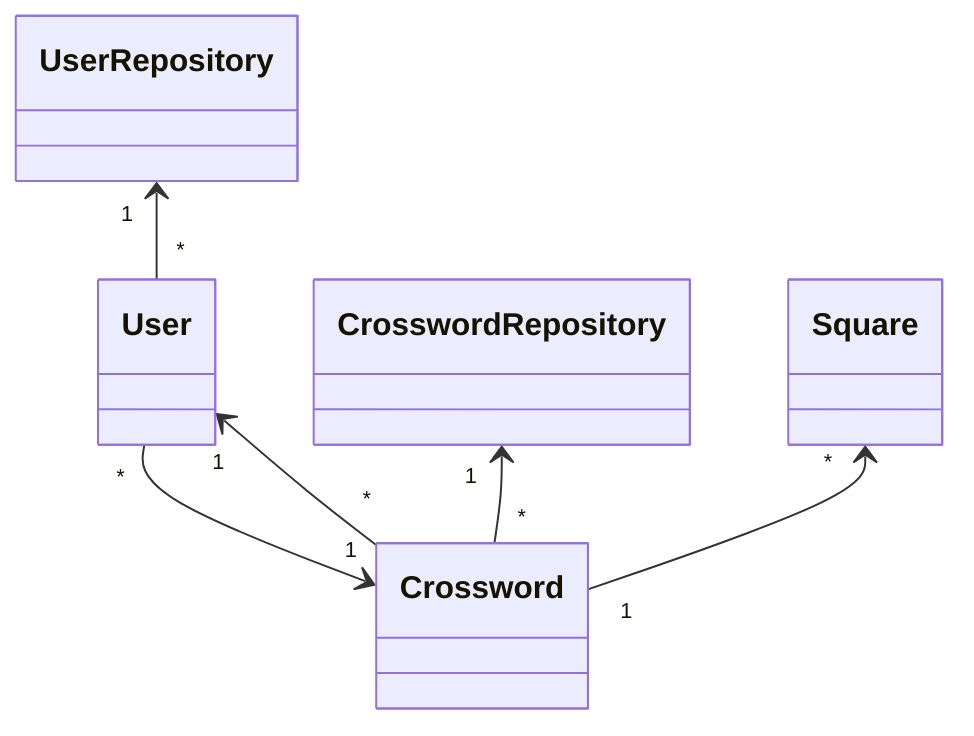

# Arkkitehtuurikuvaus

## Käyttöliittymä
Käyttöliittymässä on kaksi näkymää: tekstikäyttöliittymä kirjautumiseen ja muuhun interaktioon sovelluksen kanssa sekä graafinen käyttöliittymä ristikoiden täyttämistä varten. Tekstikäyttöliittymässä käyttäjällä on mahdollisuus kirjautumistoimintojen lisäksi valita ristikoiden pelaamisen ja laatimisen välillä. Lisäksi käyttäjä pääsee näkemään tilastoja julkaistuihin ristikoihin liittyen. Graafinen käyttöliittymä voi olla kahdessa eri tilassa: ristikon laadinta- tai ristikon täyttö -tilassa.

## Sovelluslogiikka
Tämän sovelluksen sovelluslogiikka koostuu käyttäjistä ja sanaristikoista. Sanaristikoissa jokainen ruutu on myös oma olionsa. Luokat UserRepository ja CrosswordRepository vastaavat kukin tahollaan olioiden organisoinnista ja niihin liittyvien toiminnallisuuksien suorittamisesta.

