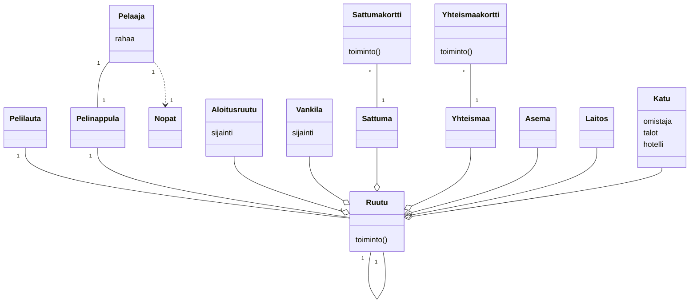

## Monopolin sovelluslogiikka

```mermaid
	classDiagram
		Pelilauta "1" -- "*" Ruutu
		Ruutu "1" -- "1" Ruutu
		Pelaaja "1" -- "1" Pelinappula
		Pelinappula "1" -- "1" Ruutu
		Pelaaja "1" ..> "1" Nopat
		Aloitusruutu --o Ruutu
		Vankila --o Ruutu
		Sattuma --o Ruutu
		Yhteismaa --o Ruutu
		Asema --o Ruutu
		Laitos --o Ruutu
		Katu --o Ruutu
		Katu : omistaja
		Katu : talot
		Katu : hotelli
		Pelaaja : rahaa
		Aloitusruutu : sijainti
		Vankila : sijainti
		Ruutu : toiminto()
		Sattumakortti "*" -- "1" Sattuma
		Yhteismaakortti "*" -- "1" Yhteismaa
		Sattumakortti : toiminto()
		Yhteismaakortti : toiminto()
```
